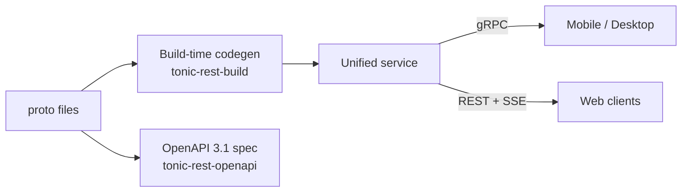

# API-First Design: gRPC, REST, and SSE from a Single Source of Truth — Rust & Flutter

> Define API once and get gRPC for mobile and desktop, REST with Server-Sent Events for browsers, and a complete OpenAPI 3.1 specification — all generated at build time, with zero drift.

**Contents:** [Why Contract-First](#why-contract-first) · [The Protocol Gap](#the-protocol-gap) · [Existing Approaches](#existing-approaches) · [tonic-rest](#tonic-rest-compile-time-grpc-to-rest-translation) · [Key Capabilities](#key-capabilities) · [SSE](#sse-for-server-streaming) · [12-Phase Pipeline](#the-12-phase-openapi-pipeline) · [Real-World Example](#real-world-example-auth-service-rs) · [Cross-Platform Clients](#cross-platform-clients) · [Beyond Request-Response](#beyond-request-response) · [Conclusion](#conclusion)

No single protocol serves every client well. Mobile and desktop thrive on gRPC; browsers expect REST. Maintaining two separate API contracts for the same service is a liability that grows with every endpoint and every release.

We will explore the tension between **gRPC** and **REST**, evaluate existing bridging approaches, and present a compile-time solution that generates both protocols from annotated proto files — including production-grade **OpenAPI** documentation, **SSE** for server streaming, and cross-platform client generation with **Rust** and **Flutter**.

---

## Why Contract-First

Designing the API contract before implementation — the core of contract-first — lets teams work in parallel: frontend engineers build against mocked APIs, backend engineers implement services, QA writes tests from the spec. A shared specification becomes the single reference for endpoints, payloads, error models, authentication flows, and versioning. Catching problems at the contract level is far cheaper than refactoring after integration surprises surface in staging.

For organizations running microservices, contract-first enforces consistent patterns (naming conventions, pagination, error structures) across all teams and services. Every client — web, mobile, or automation script — receives the same capabilities under the same contract.

Contract-first also shifts security left. Authentication, authorization, data exposure rules, and threat modeling happen at design time, not as afterthoughts during code review. Monitoring scopes derive directly from the contract: SLOs per endpoint, error codes, rate limits, and deprecation schedules.

These advantages compound when automation is introduced. A machine-readable contract drives codegen for server handlers, client SDKs, data models, and documentation — each generated artifact structurally correct by construction, eliminating the serialization bugs and field mismatches that manual synchronization inevitably introduces.

This is where the protocol gap becomes the central challenge.

---

## The Protocol Gap

Building a modern multi-platform application means acknowledging that different clients have fundamentally different requirements.

**gRPC** is the natural choice for mobile and desktop. HTTP/2 multiplexing keeps connections efficient over unreliable cellular networks. Protobuf binary serialization produces payloads significantly smaller than JSON, reducing bandwidth and improving battery life. Bidirectional streaming enables real-time features without polling. Proxy-based workarounds like gRPC-Web attempt to bring gRPC to browsers, but they typically run over HTTP/1.1, which loses the multiplexing advantage and offers more limited debugging tooling than standard browser developer tools.

**REST with SSE** is the natural choice for web applications. Browser developer tools, API gateways, security scanners, CDN caches, and the entire HTTP ecosystem are built around REST. For real-time data, Server-Sent Events provide a lightweight, standards-based streaming mechanism through the native browser `EventSource` API, with automatic reconnection and compatibility with standard HTTP proxies.

**The tension is fundamental.** gRPC is defined by Protobuf specs; OpenAPI specs define REST. Both are excellent in their domains, but maintaining two separate contracts for the same API is unsustainable. The contracts *will* drift, creating broken clients, inconsistent documentation, and teams debugging phantom mismatches between protocols.

---

## Existing Approaches

[**gRPC-Gateway**](https://github.com/grpc-ecosystem/grpc-gateway) is a runtime reverse proxy that translates REST to gRPC. It reads `google.api.http` annotations from proto files and generates a Go reverse proxy translating REST requests into gRPC calls. It is mature, widely deployed, and well-documented within the Go ecosystem, but adds a translation layer: every REST request passes through proxy machinery before reaching the service.

[**Connect**](https://connectrpc.com/) eliminates the proxy by defining a protocol that speaks both gRPC and JSON-based HTTP from the same handler. Connect supports idiomatic GET and POST requests but does not leverage the full range of HTTP methods (PUT, DELETE, PATCH) and cannot express URL-based resource hierarchies. This limits compatibility with API gateways, OpenAPI tooling, security scanners, and caching layers that expect standard REST conventions.

Both approaches have clear strengths and specific trade-offs: gRPC-Gateway adds operational overhead from its proxy layer, while Connect limits compatibility with standard REST tooling. Neither generates production-grade OpenAPI 3.1 documentation directly from proto files.

Within Rust, several crates address parts of the problem: [tonic-web](https://crates.io/crates/tonic-web), [utoipa](https://crates.io/crates/utoipa), [aide](https://crates.io/crates/aide), [poem-openapi](https://crates.io/crates/poem-openapi) + [poem-grpc](https://crates.io/crates/poem-grpc), and [dropshot](https://crates.io/crates/dropshot). None bridge gRPC and REST from proto files with build-time codegen, automatic SSE, and OpenAPI 3.1 generation in a single pipeline.

The following matrix evaluates each approach against capabilities critical for multi-protocol API infrastructure:

| Capability                        | **tonic&#8209;rest** | gRPC&#8209;Gateway | Connect | tonic&#8209;web | utoipa / aide | poem&#8209;openapi | dropshot |
| --------------------------------- | :------------------: | :----------------: | :-----: | :-------------: | :-----------: | :----------------: | :------: |
| Proto-first (single source)       |          ✅           |         ✅          |    ✅    |       ⚠️⁴        |       ❌       |         ❌          |    ❌     |
| gRPC + full REST semantics        |          ✅           |         ✅          |   ⚠️⁷    |        ❌        |       ❌       |         ⚠️¹         |    ❌     |
| Compile-time, zero proxy overhead |          ✅           |         ❌          |    ✅    |        ❌        |       ✅       |         ✅          |    ✅     |
| OpenAPI 3.1 generation            |          ✅           |         ⚠️⁶         |    ❌    |        ❌        |       ✅       |         ✅          |    ⚠️²    |
| SSE from server-streaming RPCs    |          ✅           |         ❌          |    ❌    |        ❌        |       ❌       |         ❌          |    ❌     |
| Shared middleware stack           |          ✅           |         ❌          |    ✅    |        ❌        |      N/A      |         ⚠️³         |   N/A    |
| Ecosystem maturity                |          ⚠️⁵          |         ✅          |    ✅    |        ✅        |       ✅       |         ✅          |    ✅     |

<sub>¹ poem-grpc exists separately but does not share handlers with poem-openapi. ² Dropshot generates OpenAPI 3.0. ³ poem-openapi and poem-grpc run as separate services. ⁴ tonic-web wraps existing gRPC for browser access; it does not generate REST from proto. ⁵ tonic-rest is v0.1.x; API surface may evolve. ⁶ gRPC-Gateway generates OpenAPI 2.0 via protoc-gen-openapiv2, not 3.1. ⁷ Connect uses POST-centric RPC semantics by default; custom HTTP transcoding is opt-in and does not expose standard REST resource hierarchies (GET/PUT/DELETE on resources).</sub>

---

## tonic-rest: Compile-Time gRPC-to-REST Translation

[**tonic-rest**](https://crates.io/crates/tonic-rest) is a Rust library ecosystem that reads standard `google.api.http` annotations from proto files and generates type-safe [Axum](https://github.com/tokio-rs/axum) REST handlers at **build time**, alongside existing [Tonic](https://github.com/hyperium/tonic) gRPC services. The generated handlers call the same service trait methods as gRPC does, without a runtime proxy or reflection.

Rust's `build.rs` (a pre-compilation build script) runs before the main compilation, so generated handlers are verified by the compiler alongside application code — type mismatches surface as build errors, not runtime failures. Tonic and Axum share the same Tokio async runtime (Rust's standard async I/O executor), so gRPC and REST coexist in a single process: the same service trait, the same middleware stack, and the same connection pool.

The ecosystem comprises four crates:

- **tonic-rest-core** — shared protobuf descriptor types preserving `google.api.http` annotations
- **tonic-rest-build** — build-time codegen producing Axum handlers from proto descriptors
- **tonic-rest** — runtime utilities for error mapping, SSE, request bridging, and serde adapters
- **tonic-rest-openapi** — 12-phase pipeline producing enriched OpenAPI 3.1 specifications

---

### How It Works

The process starts with standard `google.api.http` annotations — the same format used by Google Cloud APIs and gRPC-Gateway, not a proprietary DSL:

```protobuf
service UserService {
  rpc ListUsers(ListUsersRequest) returns (stream User) {
    option (google.api.http) = {
      get: "/v1/users"
    };
  }
  rpc CreateUser(CreateUserRequest) returns (User) {
    option (google.api.http) = {
      post: "/v1/users"
      body: "*"
    };
  }
}
```

The `body: "*"` directive maps the entire request message to the JSON body. Fields matching path template variables are extracted from the URL; when `body: "*"` is set, remaining fields populate the JSON body. Omitting `body` (for GET/DELETE) means all non-path fields become query parameters — following the same semantics as [Google's API Design Guide](https://cloud.google.com/apis/design).

Note that `ListUsers` returns a `stream` — this RPC will automatically become an SSE endpoint, covered in [SSE for Server Streaming](#sse-for-server-streaming).

The build script compiles proto files as usual (via prost, Rust's Protobuf code generator, and tonic), then passes the descriptor set to tonic-rest-build, which scans for HTTP annotations and generates Axum router source code:

```rust
// build.rs — generate REST handlers alongside standard gRPC
let rest_config = RestCodegenConfig::new();
let code = generate(&descriptor_bytes, &rest_config)?;
std::fs::write(format!("{out_dir}/rest_routes.rs"), code)?;
```

The generated router merges directly with the gRPC service — both protocols serve from the same binary:

```rust
let app = Router::new()
    .merge(user_service_rest_router(service.clone()))
    .merge(tonic_grpc_router);
```



New RPCs with HTTP annotations automatically produce REST endpoints on the next build. Generated code is verified against committed golden file snapshots (expected-output files that detect regressions), so codegen changes surface as test failures before they reach production. Since generated handlers call service methods directly— without a serialization round-trip or a proxy hop—the REST path adds negligible latency beyond the JSON encoding overhead of a native gRPC call.

---

## Key Capabilities

### Custom Protobuf Extension Decoding

The `google.api.http` annotation lives at Protobuf field tag 72295728, a registered extension number in `google.protobuf.MethodOptions`. Standard code generators (including prost, Rust's Protobuf compiler) decode only known fields and drop this extension during deserialization. Without it, there is no HTTP annotation data to work with.

tonic-rest-core solves this by defining custom `prost::Message` types that explicitly include the extension field. When the descriptor set is decoded through these types, the HTTP annotation survives deserialization intact.

### Type Safety

The codegen pipeline enforces type correctness at multiple levels:

- **Auto-discovery** — the codegen scans for services with HTTP annotations; no explicit package listing required
- **Path parameters** — scalars, proto enums, and UUID wrapper types are parsed and validated with structured errors
- **Serde adapters** — Timestamps serialize as RFC 3339, Durations as proto JSON format (`300s`), FieldMasks as camelCase, and enums with stripped prefixes
- **Zero boilerplate** — all adapters are wired without manual `#[serde]` annotations

### Protocol Bridging

Because gRPC and REST are both HTTP under the hood, they share a single Tower middleware stack (Tower is Rust's composable HTTP middleware framework):

- **Request extensions** — Axum extensions (auth context, session tokens) flow into Tonic request extensions transparently
- **Header forwarding** — `Authorization`, `User-Agent`, `X-Forwarded-For`, `X-Real-IP` propagate from REST to gRPC automatically; additional headers (including Cloudflare's `CF-Connecting-IP`) are supported via configurable forwarding
- **Public endpoint registry** — a build-time `&[&str]` constant (`PUBLIC_REST_PATHS`) lists all public REST endpoints, suitable for building a `HashSet` for efficient auth middleware lookups

### OpenAPI Enrichment

The pipeline detects responses with `redirect_url` fields and generates 302 redirect documentation. Proto `validate.rules` annotations translate directly to JSON Schema constraints (`minLength`, `maxLength`, `format: uuid`). Common enum prefixes are stripped, and `UNSPECIFIED` sentinels are removed from the spec. See [The 12-Phase OpenAPI Pipeline](#the-12-phase-openapi-pipeline) for the full transform chain.

### Error Mapping

All 17 gRPC status codes map to HTTP equivalents following Google's API design guidelines, wrapped in the [Google JSON error model](https://cloud.google.com/apis/design/errors):

```json
{
  "error": {
    "code": 403,
    "message": "Caller does not have permission",
    "status": "PERMISSION_DENIED"
  }
}
```

This mapping applies uniformly across REST endpoints and SSE error events — clients get a single error model regardless of transport.

---

## SSE for Server Streaming

Server-streaming RPCs are automatically exposed as **Server-Sent Events** endpoints. No additional configuration is needed: annotate a streaming RPC with `google.api.http` and the codegen produces an SSE handler.

```protobuf
rpc ListEvents(ListEventsRequest) returns (stream Event) {
  option (google.api.http) = { get: "/v1/events" };
}
```

Each successful message serializes as a JSON SSE event. Errors are emitted as `event: error` events follow the same Google API error model, maintaining a consistent envelope across transports. A configurable keep-alive interval prevents connection timeouts through proxies.

> **SSE vs WebSockets.** SSE operates over standard HTTP, flows through load balancers and CDN proxies without special configuration, and provides automatic reconnection with `Last-Event-ID` out of the box. For server-to-client streaming (live feeds, notifications, progress updates), SSE is the simpler, more infrastructure-friendly choice. For bidirectional communication, WebSocket remains the appropriate tool.

---

## The 12-Phase OpenAPI Pipeline

The OpenAPI pipeline transforms raw proto-derived specifications into enriched, spec-compliant documentation through 12 sequential phases. Each phase is independently testable and composable, grouped by concern:

**Structure & Streaming**

1. **Structural** — migrate to OpenAPI 3.1, inject server URLs and metadata
2. **Streaming** — annotate SSE endpoints with `text/event-stream` and `Last-Event-ID`

**Content & Semantics**

3. **Responses** — rewrite status codes (empty → 204, create → 201), inject error schemas
4. **Enum Rewrites** — strip common prefixes, remove `UNSPECIFIED` sentinels
5. **Markers** — flag unimplemented stubs (501) and deprecated operations
6. **Security** — inject Bearer JWT scheme with public endpoint overrides

**Refinement**

7. **Cleanup** — extract summaries, remove empty bodies, and unused schemas
8. **UUID Flattening** — inline wrapper messages as `format: uuid`, simplify path templates
9. **Validation** — convert `validate.rules` to JSON Schema constraints; apply `writeOnly`/`readOnly`; rewrite Duration fields
10. **Path Field Stripping** — remove path-bound fields from request bodies; enrich path parameters with proto constraints

**Finalization**

11. **Inlining** — inline `$ref` with heuristic examples for 30+ field patterns (email, phone, URL, timestamps, etc.); remove orphaned schemas
12. **Normalization** — normalize line endings and formatting

Phase 9 (Validation) deserves a closer look. Proto validation annotations map directly to JSON Schema constraints:

```protobuf
string password = 1 [(validate.rules).string = {min_len: 8, max_len: 128}];
string user_id = 2 [(validate.rules).string.uuid = true];
string code = 3 [(validate.rules).string.pattern = "^[A-Z]{3}$"];
```

becomes:

```json
"password": { "type": "string", "minLength": 8, "maxLength": 128 },
"user_id": { "type": "string", "format": "uuid" },
"code": { "type": "string", "pattern": "^[A-Z]{3}$" }
```

---

## Real-World Example: auth-service-rs

[**auth-service-rs**](https://github.com/zs-dima/auth-service-rs) is a production authentication service built with tonic-rest, providing a complete end-to-end example with proto files, `build.rs`, REST handlers, and OpenAPI generation. For the full architectural walkthrough, see the [deep-dive article](https://dmitrii.app/rust-grpc-authentication-service-cross-platform-client/).

**One Port, Three Protocols:** auth-service-rs serves gRPC, gRPC-Web, and REST on a single port. Content-Type detection automatically routes requests: `application/grpc` for native mobile and desktop, `application/grpc-web` for browser gRPC clients, `application/json` for REST endpoints: one port, one Kubernetes Service, one TLS certificate.

**Unified Tower Middleware:** A single `ServiceBuilder` pipeline (RequestId, Trace, Timeout, CORS, Auth) applies to all three protocols. Tower's `Layer` trait is protocol-agnostic: the auth layer detects Content-Type and returns gRPC status trailers or REST JSON errors accordingly. The generated `PUBLIC_REST_PATHS` slice is loaded into a `HashSet` at startup for constant-time public route lookup, eliminating manual endpoint list maintenance.

**Cross-Platform Client:** The Flutter client [auth-app](https://github.com/zs-dima/auth-app) consumes the same API from Android, iOS, Windows, macOS, Linux, and Web: native gRPC on mobile and desktop, REST with SSE on browsers. The server's protocol multiplexing makes this transparent to the client. The next section explores the client architecture in detail.

---

## Cross-Platform Clients

The server-side contract-first approach extends naturally to clients. Since proto files are the shared contract, each platform gets a protocol-optimal client generated from the same definitions: gRPC for native platforms, where HTTP/2 and binary serialization provide the best performance; REST with SSE for web, where browser APIs and standard HTTP infrastructure are the natural fit.

Flutter is an ideal case study: a single Dart codebase targets Android, iOS, Windows, macOS, Linux, and Web. Each platform has different protocol capabilities, and the client must select the right transport without leaking this decision into application logic.

**Platform-Aware Protocol Selection:** Dart's conditional exports resolve platform-specific implementations at compile time:

```dart
// api_client.dart — platform dispatch at compile time
export 'api_client_vm.dart'
    if (dart.library.js_interop) 'api_client_js.dart';
```

Application code imports `ApiClient` and calls `getUser()` or `listEvents()` with the protocol invisible to the caller. On Android, the call becomes a gRPC request over HTTP/2 with Protobuf framing. On the Web, it becomes a `GET /v1/users/{user_id}` REST call that returns JSON, or an SSE connection streaming `text/event-stream` events. Same API surface, optimal transport per platform.

On the native side, Dart's [`protoc_plugin`](https://pub.dev/packages/protoc_plugin) generates typed gRPC stubs from the same proto files that drive the server. On the web side, a companion Dart codegen tool reads proto files and the generated OpenAPI specification to produce a typed REST client with SSE support. The same contract closes the loop from server to client across both protocols.

---

## Beyond Request-Response

The contract-first discipline established earlier extends beyond synchronous APIs. Modern architectures often need asynchronous event delivery, from internal microservices communicating via pub/sub to real-time updates pushed to thousands of clients.

### Service-Side Event Buses

Microservices need asynchronous messaging: event sourcing, command dispatch, and fan-out notifications. Traditional brokers like [Kafka](https://kafka.apache.org/) (JVM clusters, Schema Registry for Protobuf) and [RabbitMQ](https://www.rabbitmq.com/) (Erlang VM, plugins, manual serialization) solve this at the cost of operational complexity. Cloud-native systems are moving toward simpler message planes that treat Protobuf as a first-class citizen. [NATS](https://nats.io/) is a cloud-native messaging system that ships as a single Go binary with minimal configuration. It provides pub/sub, request-reply, and persistent streaming (JetStream) with exactly-once delivery at sub-millisecond latency. Protobuf payloads require no schema registry or serialization adapters. Built-in leaf nodes enable edge deployments without additional infrastructure, and the Rust async client integrates cleanly into a Tokio runtime alongside Tonic and Axum.

### Client-Side Real-Time Delivery

[Centrifugo](https://centrifugal.dev/) handles real-time fan-out: publish an event once, and Centrifugo delivers it to thousands of subscribers over WebSocket, SSE, or HTTP-streaming. It ships as a single Go binary with minimal configuration, supports native Protobuf protocol, and provides presence tracking, channel history, and automatic recovery.

For custom bidirectional protocols, **WebSocket with Protobuf** provides low-latency transport using compact binary frames that follow the same protocol contracts as gRPC and REST. Centrifugo uses this pattern internally; services can also implement it directly for use cases beyond SSE or gRPC-Web streaming.

### WebAssembly with Protobuf

WebAssembly extends the contract-first approach beyond server and client boundaries. WASM modules decode Protobuf directly in the browser or at the edge (Cloudflare Workers, Fastly Compute, Deno Deploy), enabling shared validation logic and consistent data handling across runtimes. The same message types that generate server handlers and client SDKs compile into WASM modules that parse and validate the identical wire format, without language-specific reimplementation.

---

These technologies share a common thread: Protobuf definitions remain the canonical contract. The same proto files that drive build-time REST codegen and OpenAPI generation also govern NATS event buses, Centrifugo fan-out channels, WebSocket binary frames, and WASM edge modules. The "define once, generate everything" principle extends naturally from request-response APIs to the full spectrum of modern communication patterns.

---

## Conclusion

Contract-first design is a strategic discipline. The modern application landscape demands gRPC for mobile and desktop efficiency and REST with SSE for web reach. Maintaining separate contracts for these protocols is a liability that grows with each endpoint, team, and release cycle.

The contract-first approach delivers compounding returns through automated code generation: typed client SDKs, data models, and server stubs produced for every platform from a single definition. The compiler verifies each generated artifact, and when the contract evolves, every consumer discovers breaking changes as build errors — not production incidents.

With tonic-rest, proto files remain the canonical definition: standard `google.api.http` annotations define the REST surface; build-time codegen produces idiomatic handlers that share the same process and service logic as gRPC; and a 12-phase pipeline produces production-ready OpenAPI 3.1 documentation. The Rust compiler verifies correctness at every step.

For a complete end-to-end example, see [auth-service-rs](https://github.com/zs-dima/auth-service-rs) and the [architectural walkthrough](https://dmitrii.app/rust-grpc-authentication-service-cross-platform-client/).

1. **Define once** in Protobuf.
2. **Generate everything**: gRPC handlers, REST endpoints, typed client SDKs, data models, OpenAPI documentation.
3. **Run everywhere**: mobile, desktop, and web — from a single binary.
4. **Extend naturally**: the same proto contracts govern event-driven messaging, edge runtimes, and real-time fan-out.

One proto. Every protocol. **Zero drift.**

---

### Next Steps

### 🚀 Try It

[**tonic-rest**](https://github.com/zs-dima/tonic-rest) is open-source and production-ready.

- **⭐** [**Star on GitHub**](https://github.com/zs-dima/tonic-rest) — Support the project
- **⚡** [**Live Demo**](https://auth-demo.dmitrii.app) — See the auth flow in action
- **🔗** [**Swagger & OpenAPI**](https://auth-demo-api.dmitrii.app/swagger-ui/) — Explore the generated spec
- **📖** [**Documentation**](https://github.com/zs-dima/tonic-rest#readme) — Integration guide & API reference

**Crates:**

- **📦** [**tonic-rest**](https://crates.io/crates/tonic-rest) — Runtime: error mapping, SSE, request bridging, serde adapters
- **📦** [**tonic-rest-build**](https://crates.io/crates/tonic-rest-build) — Build-time codegen: proto descriptors → Axum handlers
- **📦** [**tonic-rest-openapi**](https://crates.io/crates/tonic-rest-openapi) — OpenAPI 3.1 generation & 12-phase pipeline

### 📚 Further Reading

**Specifications & Standards:**

- [**Google API Design Guide**](https://cloud.google.com/apis/design) — Source of `google.api.http` conventions
- [**OpenAPI 3.1 Specification**](https://spec.openapis.org/oas/v3.1.0) — The output format for generated specs
- [**Protocol Buffers Language Guide**](https://protobuf.dev/programming-guides/proto3/) — Proto3 reference
- [**SSE Specification (WHATWG)**](https://html.spec.whatwg.org/multipage/server-sent-events.html) — Server-Sent Events standard

**Rust Ecosystem:**

- [**Tonic**](https://github.com/hyperium/tonic) — gRPC framework for Rust
- [**Axum**](https://github.com/tokio-rs/axum) — HTTP framework for Rust
- [**Tower**](https://github.com/tower-rs/tower) — Composable middleware framework for Rust
- [**prost**](https://github.com/tokio-rs/prost) — Protobuf compiler for Rust

**Security:**

- [**OWASP Auth Cheat Sheet**](https://cheatsheetseries.owasp.org/cheatsheets/Authentication_Cheat_Sheet.html) — Authentication security reference

---

### 🤝 Let’s Connect

I’m a software engineer building high-performance systems. If you have questions or want to clarify details, feel free to reach out.

[**Blog**](https://dmitrii.app/) · [**GitHub**](https://github.com/zs-dima) · [**LinkedIn**](https://www.linkedin.com/in/zs-dima/) · [**X / Twitter**](https://x.com/zs_dima) · [**Email**](mailto:info@dmitrii.app)


_with ❤️_ [_Dmitrii Zusmanovich_](https://www.linkedin.com/in/zs-dima/?ref=dmitrii.app)
